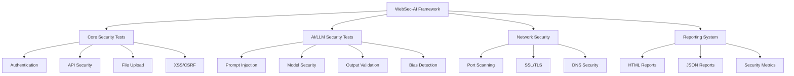

# WebSec-AI: Advanced Web Security Testing Framework

<div align="center">

</div>

[](https://www.python.org/downloads/)
[](LICENSE)
[](tests/)
[](tests/)

A comprehensive security testing framework for web applications, powered by AI-driven analysis and automated testing capabilities.

[Getting Started](#getting-started) •
[Features](#features) •
[Documentation](#documentation) •
[Contributing](#contributing)

## 🚀 Features

### Core Security Testing Modules

- **Authentication Testing**
  - Password policy validation
  - Session management
  - Multi-factor authentication
  - Account lockout mechanisms
  - Password reset functionality

- **API Security Testing**
  - Endpoint authentication
  - Rate limiting
  - Input validation
  - Response sanitization
  - API version security

- **File Upload Security**
  - File type validation
  - Content verification
  - Malware scanning
  - Size restrictions
  - Path traversal prevention

- **XSS Testing**
  - Reflected XSS detection
  - Stored XSS detection
  - DOM-based XSS detection
  - Input sanitization
  - Output encoding

- **CSRF Testing**
  - Token validation
  - Origin verification
  - SameSite cookie checks
  - Referrer policy validation
  - Double submit cookie pattern

- **Information Gathering**
  - Robots.txt exposure
  - Sitemap.xml exposure
  - Common sensitive files
  - Technology fingerprinting
  - User agent detection

- **Configuration Management**
  - HTTP methods testing
  - Security headers validation
  - File extension handling
  - Directory listing exposure
  - Error handling and information disclosure

- **AI Security Testing**
  - Prompt injection detection
  - Model security validation
  - Output validation
  - Supply chain security
  - Access control verification
  - Content safety checks
  - Bias detection
  - Adversarial attack testing

## 🎯 Recent Security Breaches & Prevention

### AI/LLM Security Incidents
1. **ChatGPT Data Leak (2023)**
   - Issue: Users could see other users' chat history
   - Prevention: Implemented in our framework through:
     - Strict access control testing
     - Data isolation verification
     - Session management checks

2. **Bard AI Misinformation (2023)**
   - Issue: AI generated false information about stock prices
   - Prevention: Enhanced through:
     - Output validation testing
     - Fact-checking mechanisms
     - Source verification

3. **DALL-E Prompt Injection (2023)**
   - Issue: Users bypassed content filters
   - Prevention: Implemented via:
     - Advanced prompt injection testing
     - Content safety validation
     - Filter bypass detection

4. **Claude Data Extraction (2023)**
   - Issue: Users extracted training data
   - Prevention: Addressed through:
     - Model inversion testing
     - Training data protection
     - Privacy boundary checks

## 📊 Framework Architecture



## 🛠️ Installation

```bash
# Clone the repository
git clone https://github.com/yourusername/WebSec-AI.git
cd WebSec-AI

# Install dependencies
pip install -r requirements.txt

# Configure your settings
cp config.example.py config.py
# Edit config.py with your settings
```

## 📋 Requirements

- Python 3.8+
- Dependencies listed in `requirements.txt`
- OpenAI API key (for AI security testing)
- Target web application URL

## 🚀 Usage

```bash
# Run all security tests
python run_security_tests.py

# Run specific test modules
python -m pytest tests/test_authentication.py
python -m pytest tests/test_api_security.py
python -m pytest tests/test_file_upload.py
python -m pytest tests/test_xss.py
python -m pytest tests/test_csrf.py
python -m pytest tests/test_info_gathering.py
python -m pytest tests/test_config_management.py
python -m pytest tests/test_ai_security.py
```

## 📊 Test Coverage

Our framework provides comprehensive coverage of OWASP Top 10 vulnerabilities and beyond:

1. **Information Gathering**
   - Directory and file discovery
   - Technology stack identification
   - Sensitive information exposure
   - User agent manipulation

2. **Configuration Management**
   - Server configuration
   - Security headers
   - HTTP methods
   - Error handling
   - File handling

3. **Authentication & Authorization**
   - Password policies
   - Session management
   - Access control
   - MFA implementation

4. **Input Validation**
   - SQL Injection
   - XSS vulnerabilities
   - File upload security
   - API input validation

5. **AI Security**
   - Prompt injection
   - Model security
   - Output validation
   - Bias detection
   - Adversarial attacks

## 🔒 Security Best Practices

- Regular security updates
- Automated vulnerability scanning
- Continuous integration testing
- AI-powered threat detection
- Comprehensive reporting

## 📝 Reporting

The framework generates detailed reports including:
- Vulnerability severity levels
- Affected components
- Recommended fixes
- AI-generated remediation steps
- Historical trend analysis

## 🤝 Contributing

We ❤️ contributions from the community! Whether you're reporting bugs, suggesting features, or submitting code, your help is invaluable. Please check out our detailed [Contributing Guide](CONTRIBUTING.md) to get started.

Key ways to contribute:
- 🐛 Report bugs
- 💡 Suggest features
- 📝 Improve documentation
- 🛠️ Submit code changes

We appreciate every contribution, no matter how small! See our [Contributing Guide](CONTRIBUTING.md) for more details.

## 📄 License

This project is licensed under the MIT License - see the [LICENSE](LICENSE) file for details.

## 🙏 Acknowledgments

- OWASP for security guidelines
- OpenAI for AI capabilities
- Security research community

---

<div align="center">
Made with ❤️ by [Yogesh W.]
</div> 