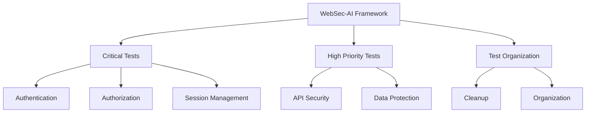

# WebSec-AI: Advanced Web Security Testing Framework

<div align="center">

</div>

[](https://www.python.org/downloads/)
[](LICENSE)
[](tests/)
[](tests/)

A comprehensive security testing framework for web applications, powered by AI-driven analysis and automated testing capabilities.

[Getting Started](#getting-started) •
[Features](#features) •
[Documentation](#documentation) •
[Contributing](#contributing)

## 🚀 Features

### Critical Security Tests

- **Authentication Testing** (`tests/critical/authentication.py`)
  - Password policy validation
  - Session management
  - Multi-factor authentication
  - Account lockout mechanisms
  - Password reset functionality

- **Authorization Testing** (`tests/critical/authorization.py`)
  - Role-based access control
  - Privilege escalation detection
  - Resource access control
  - API authorization

- **Session Management** (`tests/critical/session_management.py`)
  - Session fixation prevention
  - Session timeout enforcement
  - Concurrent session handling
  - Cookie security attributes

### High Priority Tests

- **API Security** (`tests/high/api_security.py`)
  - Endpoint authentication
  - Rate limiting
  - Input validation
  - Response sanitization
  - API version security

- **Data Protection** (`tests/high/data_protection.py`)
  - Data encryption (in transit and at rest)
  - Data integrity checks
  - Data retention policies
  - Access control mechanisms

## 📊 Framework Architecture



## 🛠️ Installation

```bash
# Clone the repository
git clone git@github.com:yogeshwankhede007/WebSec-AI.git
cd WebSec-AI

# Install dependencies
pip install -r requirements.txt
```

## 📋 Requirements

- Python 3.8+
- Dependencies listed in `requirements.txt`
- Target web application URL

## 🚀 Usage

```bash
# Run all security tests
python -m pytest tests/

# Run specific test categories
python -m pytest tests/critical/  # Critical security tests
python -m pytest tests/high/     # High priority tests

# Run individual test modules
python -m pytest tests/critical/authentication.py
python -m pytest tests/critical/authorization.py
python -m pytest tests/critical/session_management.py
python -m pytest tests/high/api_security.py
python -m pytest tests/high/data_protection.py
```

## 📊 Test Coverage

Our framework provides comprehensive coverage of critical security aspects:

1. **Authentication & Authorization**
   - Password policies
   - Session management
   - Access control
   - MFA implementation

2. **API Security**
   - Endpoint authentication
   - Rate limiting
   - Input validation
   - Response sanitization

3. **Data Protection**
   - Data encryption
   - Data integrity
   - Access control
   - Retention policies

## 🔒 Security Best Practices

- All tests are non-destructive by default
- Rate limiting for aggressive tests
- Proper error handling and logging
- Secure credential management

## 📝 Test Results

Test results are provided in a structured format:
```python
{
    "test_name": "Test Name",
    "status": "PASSED/FAILED/ERROR",
    "details": "Detailed test results"
}
```

## 🤝 Contributing

We ❤️ contributions from the community! Whether you're reporting bugs, suggesting features, or submitting code, your help is invaluable. Please check out our detailed [Contributing Guide](CONTRIBUTING.md) to get started.

Key ways to contribute:
- 🐛 Report bugs
- 💡 Suggest features
- 📝 Improve documentation
- 🛠️ Submit code changes

We appreciate every contribution, no matter how small! See our [Contributing Guide](CONTRIBUTING.md) for more details.

Please note that this project is released with a [Contributor Code of Conduct](CODE_OF_CONDUCT.md). By participating in this project you agree to abide by its terms.

## 📄 License

This project is licensed under the MIT License - see the [LICENSE](LICENSE) file for details.

## �� Acknowledgments

- OWASP for security guidelines
- Security research community

---

<div align="center">
Made with ❤️ by [Yogesh W.]
</div>
